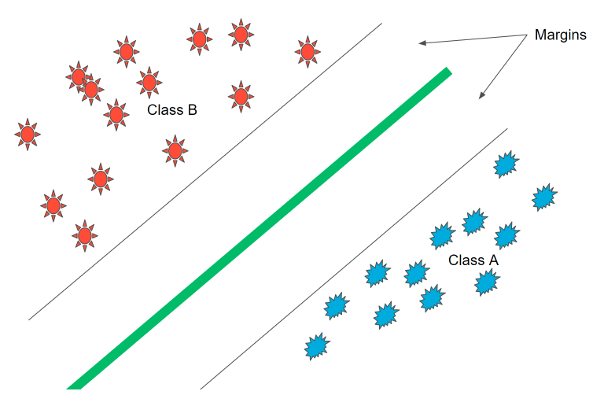

# Support Vector Machine (SVMs)
## Overview 
Support Vector Machines (SVMs) is a powerful algorithm for classification which also finds the best boundary. Some key terms/concepts include:
* minimizing distances
* error functions and the use of the Preceptron algoritm 
* the C parameter
* Polynomila Kernal
* RBF Kernal
* SVMs in sklearn
  
 
Figure. Illustrates that at a high level, SVM is still "splitting" the data with a line, but adds margins into the equation as a tool to further improve the accuracy of the training model (Udacity, Intor to Mahcine Learning with Pytorch)

## Algorithm Overview
Work to minimize ERROR = CLASSIFICATION ERROR + MARGIN ERROR

### Perceptron Algorithm
